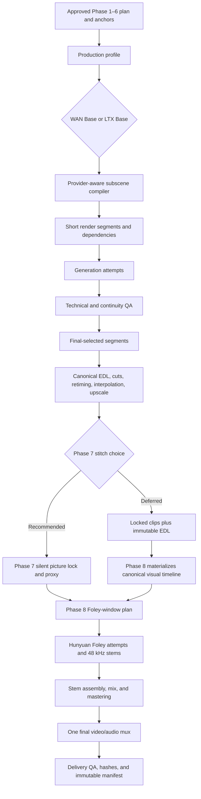

# SineForge WAN Base, Adaptive Video Continuity, and Phase 8 Audio Implementation Plan

Date: 2026-07-28

Repository: [tj1784/sineforge](https://github.com/tj1784/sineforge)

Reviewed implementation baseline: `codex/sulphur-comfy-home` at `894f59fc7d40c1b2bef3685ce98aabc851d0a81f`

Default-branch comparison baseline: `master` at `40363216015cf3f25d7b2700ca4db6aeb49e59b0`

Document status: architecture and implementation plan only; no WAN, Foley, database, or UI implementation is performed by this document

## 1. Executive decision

SineForge should introduce two versioned **base-model production themes** over one shared production system:

| Theme/profile | Purpose | Default behavior |
|---|---|---|
| `wan_base@1` | New final-quality video theme | WAN I2V/continuation is the preferred final renderer after exact workflow, model, node, license, and workstation qualification |
| `ltx_base@1` | Preserved current theme | Snapshot the current LTX 2.3 behavior, workflow, defaults, and hashes as the fast/control/fallback profile without changing its render behavior |

“Theme” in this plan means a versioned production profile containing renderer defaults, capabilities, workflow manifests, duration/frame rules, runtime requirements, UI labels, and QA policy. It is not a separate code fork and is not merely a CSS color theme.

The product pipeline should expand from seven user-facing phases to eight:

1. Script and Narrative Development
2. Scene and Shot Segmentation
3. Character Development
4. Location and Key-Asset Development
5. Production Prompt and Workflow Package
6. Image and Voice Asset Generation and Mapping
7. Video Generation, Continuity, Assembly, and Picture Lock
8. Foley, Audio Mix, Final Mux, and Delivery QA

The central production decisions are:

- Preserve existing projects and the current working renderer under `ltx_base@1`.
- Introduce `wan_base@1` as the new final-quality profile, but make it the default for new projects only after its admission tests pass.
- Treat **15–90 seconds as an editorial subscene range**, not as the duration of one WAN inference or one Foley request.
- Use 15 seconds as the preferred minimum subscene duration.
- Permit a subscene shorter than 15 seconds when the cut, action, scene requirement, or user request needs it; record the reason.
- Use 90 seconds as the hard maximum for one editorial subscene.
- Compile each subscene into multiple provider-valid WAN render segments.
- Add managed ingest for existing/uploaded video and permit a silent video to enter Phase 7 or go directly into Phase 8 for audio.
- Add an explicit Phase 7 stitch-stage choice:
  - `phase7_before_audio` — recommended default.
  - `phase8_before_foley` — supported alternative.
- Regardless of the selected phase, freeze one canonical visual timeline before Foley generation.
- Generate HunyuanVideo-Foley audio in bounded windows from that canonical timeline, assemble a lossless 48 kHz master, and mux only once.

The recommended default path is:

```text
Approved Phase 1–6 plan and visual anchors
  → WAN short render segments
  → candidate selection and continuity QA
  → final cuts, retiming, interpolation, and upscale
  → Phase 7 silent picture lock and analysis proxy
  → Phase 8 bounded Foley windows
  → dialogue/Foley/ambience/music/SFX mix
  → one final video/audio mux
  → final decode, sync, loudness, provenance, and delivery QA
```

Do not replace LTX, do not generate a 90-second WAN clip in one graph, do not put long-video continuity and Foley in one giant ComfyUI graph, and do not generate Foley against a visual timeline that can still change.

## 2. Four-agent implementation organization

The implementation should use four GPT-5.6-sol agents, including the orchestrator:

| Role | Model / effort | Primary ownership |
|---|---|---|
| Orchestrator/integrator | GPT-5.6-sol, extra-high (`xhigh`) | Shared contracts, database migration, API integration, merge order, cross-lane tests, release and rollback gates |
| Profile and workflow agent | GPT-5.6-sol, medium | `ltx_base@1` freeze, `wan_base@1` registry, recovered/reference workflow admission, manifest v2, runtime/model evidence |
| Phase 7 video agent | GPT-5.6-sol, medium | Adaptive subscene compilation, WAN attempts, continuity packets, managed video ingest, FFmpeg picture assembly, picture lock |
| Phase 8 audio agent | GPT-5.6-sol, medium | Hunyuan qualification, audio-window orchestration, stems, audio QA, mix/master/mux, Phase 8 UI |

### 2.1 Parallel-work boundary

After the orchestrator publishes the shared schema names and typed contracts, the three implementation agents can work in parallel on disjoint areas:

- The profile agent must not change Phase 7/8 execution services.
- The Phase 7 agent must not change Foley/audio services.
- The Phase 8 agent must not change WAN renderer admission or LTX snapshots.
- Shared database models, Alembic migration heads, route registration, frontend API types, and `ProductionPhasePreview.tsx` integration belong to the orchestrator.

Each lane must land behind feature flags and must be testable without enabling rendering.

### 2.2 Integration order

1. Freeze current LTX fixtures and the live runtime inventory.
2. Land additive profile and eight-phase schemas.
3. Merge profile/workflow admission, Phase 7 video, and Phase 8 audio modules.
4. Integrate routes and UI.
5. Run migration, regression, workflow, FFmpeg, and end-to-end tests.
6. Enable `ltx_base@1` first.
7. Admit `wan_base@1` after local qualification.
8. Enable Phase 8 after picture-lock and audio qualification gates pass.

Engineering rollout steps in this document are called **milestones**, never “phases,” so they cannot be confused with the eight user-facing production phases.

## 3. Evidence reviewed

### 3.1 Repository state

The connected GitHub repository’s default branch is at:

- `master` / `4036321` — “Tighten Phase 6 Flux prompt guidance.”

The local reviewed branch is:

- `codex/sulphur-comfy-home` / `894f59f` — “Integrate Sulphur planning and Comfy runtime controls.”

The reviewed branch is the correct planning baseline because it includes:

- BlokeyUI/ComfyUI supervision at `http://127.0.0.1:8888`;
- ComfyAPI Runner supervision at `http://127.0.0.1:8022`;
- Sulphur planning and project intake;
- Phase 6 local Flux image integration;
- a bounded Runner client;
- the current 8-second/6–10-second clip planner;
- frontend runtime and project controls.

### 3.2 Recovery workflow package

Reviewed archive:

`C:\Users\Blokey\Downloads\SineForge_Article_Workflow_Recovery_2026-07-28.zip`

Important contents:

- `recovered_workflows/eb118731-a38f-49e0-b539-d98d86710f58_workflow_1.json`
  - exact recovered ComfyUI visual workflow from PNG metadata;
- `recovered_workflows/eb118731-a38f-49e0-b539-d98d86710f58_prompt_1.json`
  - exact recovered executable Flux API prompt;
- `recovered_workflows/eb118731-a38f-49e0-b539-d98d86710f58_parameters_1.txt`
  - exact recovered generation record;
- `recovered_workflows/reconstructed_flux1_dev_portable_api.json`
  - portability reconstruction, not an untouched extraction;
- `recovered_workflows/official_video_wan2_2_14B_i2v.json`
  - official ComfyUI WAN reference;
- `recovered_workflows/official_video_wan2_2_14B_flf2v.json`
  - official ComfyUI first/last-frame reference;
- `recovered_workflows/official_video_wan2_2_5B_ti2v.json`
  - official ComfyUI 5B reference;
- `recovered_workflows/article_reconstruction_manifest.json`
  - provenance and article-style continuation settings;
- `recovered_workflows/README.md`
  - forensic limitations and usage guidance.

The provenance boundary is mandatory:

- The Flux graph was genuinely recovered from embedded PNG metadata.
- The WAN graphs are official ComfyUI references.
- The WAN graphs are not the article author’s missing original graph and must never be labeled as such.
- Every candidate workflow must be loaded into the exact active ComfyUI runtime, validated against `/object_info`, and exported in API format before registration.

### 3.3 Article/reference archive

Reviewed archive:

`C:\Users\Blokey\Downloads\SINFORGE.zip`

This is a roughly 2.55 GB research/reference corpus containing:

- four saved Civitai articles;
- 34 MP4 files;
- image references;
- saved-page JavaScript/CSS/assets.

It is not an executable workflow package and must not be imported wholesale into the repository.

The productizable article techniques are:

- use a strong approved image anchor;
- use I2V for identity and scene continuity;
- use the last usable accepted frame as the next continuation input;
- remove one duplicated boundary frame when the successor begins with the handoff frame;
- retain the accepted prefix and retry only a failing segment;
- periodically re-anchor identity/location/wardrobe rather than propagating only a degraded last frame;
- interpolate and upscale only after candidate selection and picture assembly;
- keep long-video orchestration in SineForge instead of duplicating many large ComfyUI boxes.

### 3.4 Attached architecture materials

Reviewed:

- `C:\Users\Blokey\.codex\attachments\36152b98-b8f6-40f6-87e4-1450f4382e70\pasted-text.txt`
- `C:\Users\Blokey\.codex\attachments\4d655496-0e10-4124-9a8a-9d306c691124\pasted-text.txt`

The supplied long-form architecture is accepted as the starting design, with these changes:

- convert the current LTX singleton into `ltx_base@1`;
- introduce `wan_base@1`;
- change product phase count from seven to eight;
- make product Phase 8 the audio/Foley phase;
- treat 15–90 seconds as the editorial subscene policy;
- make the Phase 7 versus Phase 8 stitch choice explicit;
- add managed existing-video ingest and a direct audio-only entry path.

## 4. Current architecture and concrete gaps

### 4.1 LTX is currently a global singleton

`backend/app/services/generation_model_contract.py` hard-codes:

- `VIDEO_MODEL_KEY = "ltx2_3_22b_distilled_1_1_fp8"`;
- `VIDEO_MODEL = "ltx-2.3-22b-distilled-1.1-fp8.safetensors"`;
- one modality-to-video-model mapping;
- base-model validation that expects the single LTX filename.

`backend/app/services/workflows/candidate_catalog.py` is also centered on LTX workflow candidates.

This must become a capability/admission registry selected through a versioned production profile.

### 4.2 Product phase count is enforced as seven

The seven-phase assumption exists in:

- `backend/app/db/base.py`
  - `ProductionPhase.phase_number`;
  - `ck_production_phase_number` currently restricts the value to 1–7;
- `backend/app/services/production_phases.py`
  - module contract and `PHASE_DEFINITIONS`;
- Pydantic schemas and API responses;
- frontend phase switches, headings, and workspace tabs;
- tests that assert `range(1, 8)` or `[1, 2, 3, 4, 5, 6, 7]`.

Phase 8 therefore requires an additive migration and full contract update. It is not a UI-only label change.

### 4.3 Phase 7 currently combines too many concerns

The current Phase 7 preview combines:

- planned video clips;
- visual assembly;
- audio/subtitle lanes;
- manifest/QA;
- final delivery language.

The target split is:

- Phase 7 owns video generation, continuity, editorial assembly, post-processing, and picture lock.
- Phase 8 owns Foley, audio candidates, audio stems, mix/master, final mux, and delivery QA.

### 4.4 Duration rules are inconsistent

`backend/app/services/clip_planning.py` currently defines:

- nominal 8 seconds;
- minimum 6 seconds;
- maximum 10 seconds.

Storyboard settings separately default to a 6–12-second shot band. Tests assert both 6–10 and 6–12 behavior.

The implementation must separate editorial duration from provider render duration instead of replacing one magic number with another.

### 4.5 Runner and FFmpeg foundations exist but execution is incomplete

Existing foundations:

- `backend/app/services/comfy/runner.py` can probe Runner health, analyze workflows, submit guarded jobs, obtain job state, and request a controlled restart.
- `backend/app/services/ffmpeg/service.py` can probe assets, hash files, compare stream signatures, choose a basic normalization plan, and validate approved template IDs.
- queue reservation, heartbeat, transition, and stale-job recovery exist.

Missing production behavior:

- SineForge does not yet own the complete Runner job lifecycle for Phase 7 video.
- General video output collection, managed import, and lineage are absent.
- FFmpeg service does not yet execute durable approved assembly/audio templates.
- Runtime status still reports FFmpeg assembly/output collection as disabled.
- There is no picture-lock record.
- There is no Phase 8 audio execution ledger.

## 5. Target domain model and terminology

Use these distinct units:

| Unit | Meaning | Duration policy |
|---|---|---|
| Project | Complete production | User-defined |
| Chapter | Narrative organization | User-defined |
| Scene | One dramatic/location/time unit | User-defined |
| Editorial subscene | Coherent production/editing unit inside a scene | Preferred minimum 15 s; hard maximum 90 s; shorter allowed with reason |
| Shot | One camera/edit beat | Determined by action and cut |
| Render segment | One provider-valid WAN/LTX generation request | Defined by admitted workflow frame/FPS constraints |
| Foley window | One video-to-audio request | 1–15 s; target approximately 8 s during qualification |

### 5.1 Editorial subscene duration contract

Store:

```text
preferred_min_subscene_duration_sec = 15
max_subscene_duration_sec = 90
allow_short_subscene = true
short_subscene_reason = required when duration < 15
```

Rules:

- A subscene may be 15–90 seconds by default.
- A subscene may be shorter than 15 seconds for a cutaway, reaction, insert, bridge, action beat, transition, scene-specific requirement, or explicit user request.
- A short-subscene reason must be persisted and displayed in review.
- A subscene may not exceed 90 seconds; split it at a semantic/editable boundary.
- Project and scene duration may exceed 90 seconds because they contain multiple subscenes.
- Phase 2 should propose durations, but the user can override them within these rules.

### 5.2 Provider compilation contract

Do not send editorial seconds directly to a model. Compile:

```text
Editorial subscene
  → selected production profile
  → admitted renderer capability
  → valid frame-count render segments
  → dependencies and continuity packets
  → generation attempts
  → accepted final segments
```

For the recovered official WAN quality reference:

- 81 frames at 16 FPS is approximately 5.06 seconds;
- quality profile: 20 steps, CFG 4.0, expert split 10, shift 8.0;
- LightX2V profile: 4 steps, CFG 1.0, expert split 2, shift 5.0.

Those are evidence-backed qualification candidates, not universal defaults.

A 15-second subscene may compile to roughly three WAN segments. A 90-second subscene may compile to roughly eighteen. Exact counts must use the admitted profile’s frame rule and must not rely on nominal seconds.

### 5.3 Foley duration contract

Use the stricter model contract:

- minimum supported window: 1 second;
- qualification target: approximately 8 seconds;
- optional qualified target range: 8–12 seconds;
- maximum: 15 seconds;
- wrapper limit: never exceed 450 frames;
- exact frame/PTS range is authoritative.

Never reduce the source FPS merely to force a long timeline into one Foley request.

## 6. Versioned production-profile architecture

Add a first-class `ProductionProfile` or equivalent versioned registry.

Minimum fields:

```text
profile_key
profile_version
display_name
description
status: draft | qualified | admitted | deprecated
renderer_family
default_for_new_projects
capabilities[]
workflow_template_ids[]
workflow_hashes[]
model_inventory[]
model_hashes[]
required_node_classes[]
custom_node_packages_and_commits[]
supported_resolutions[]
supported_fps[]
frame_rule
render_segment_min/max
memory_and_offload_policy
license_policy
tested_hardware_profile
benchmark_evidence
ui_metadata
created_at
supersedes_profile_id
```

### 6.1 `ltx_base@1`

Before changing generation logic:

1. Export the exact current working LTX API workflow.
2. Hash the workflow and manifest.
3. Record exact model, encoder, VAE, LoRA, node package, and runtime hashes.
4. Capture Runner request/job fixtures.
5. Capture active `/object_info`.
6. Create regression fixtures for one short generation and its patch plan.
7. Register the result as `ltx_base@1`.
8. Assign all existing projects to `ltx_base@1` during migration.

`ltx_base@1` remains:

- fast preview;
- motion/timing draft;
- control and lip-sync where admitted;
- fallback when WAN is unavailable;
- selectable for new projects.

No LTX attempt, asset, or selected output is overwritten when a user promotes work to WAN.

### 6.2 `wan_base@1`

Initial capabilities:

- image-to-video;
- continuation from an accepted handoff frame;
- first/last-frame bridging when qualified;
- high/low-noise model stages;
- model-only high/low LoRA stacks;
- LightX2V fast candidate;
- final-quality candidate;
- canonical-reference re-anchoring;
- optional VACE/firstclip extension after qualification.

Initial workflow families:

| ID | Purpose |
|---|---|
| `CF-VID-WAN-I2V-QA-01` | One quality WAN I2V segment |
| `CF-VID-WAN-I2V-FAST-01` | One LightX2V WAN I2V preview segment |
| `CF-VID-WAN-CONTINUE-01` | Continuation from accepted handoff |
| `CF-VID-WAN-FLF2V-01` | First/last-frame bridge |
| `CF-VID-WAN-VACE-01` | Optional long-video/firstclip extension after local qualification |

`wan_base@1` becomes the default for new projects only when:

- models are complete and hash-verified;
- exact node classes are present;
- API-format workflows validate against the active runtime;
- one-segment and continuation-pair tests pass;
- memory, recovery, and thermal soak tests pass;
- output collection and provenance pass;
- license/use gates pass.

### 6.3 Profile selection behavior

- Add `production_profile_id` to project/story settings.
- Existing projects migrate to `ltx_base@1`.
- A new-project selector offers WAN Base and LTX Base.
- Until WAN admission, WAN remains visible as “qualification required” rather than falsely available.
- Switching a profile creates a settings version and affects only new attempts.
- Historical attempts retain their original profile and hashes.
- “Promote to WAN” creates new WAN attempts from canonical references and approved motion/timing; it never mutates LTX outputs.

## 7. Target production architecture



SineForge is the source of truth. ComfyAPI Runner is an executor adapter. ComfyUI executes models. FFmpeg performs only approved transforms. No external executor owns canonical project state, candidate selection, picture lock, or final export truth.

## 8. Phase 7: video generation, continuity, and picture lock

### 8.1 Phase 7 inputs

Phase 7 accepts:

- approved Phase 6 starting images;
- canonical character/location/wardrobe/prop references;
- approved LTX preview motion/timing facts;
- generated WAN or LTX clips;
- uploaded/existing video;
- continuation handoff frames;
- selected production profile;
- editorial subscene and shot plan.

### 8.2 Managed existing-video ingest

Add an ingest workflow for `.mp4`, `.mov`, `.mkv`, and explicitly admitted formats:

1. Browser upload or approved local-path copy.
2. Resolve the source inside an approved root.
3. Copy into managed project storage; never mutate the original.
4. Compute SHA-256.
5. Run `ffprobe`.
6. Validate decode, duration, streams, FPS/time base, dimensions, pixel format, rotation, and disk budget.
7. Persist source and managed paths, provenance, and media role.
8. Permit assignment as:
   - timeline clip;
   - subscene source;
   - continuity reference;
   - video-to-video input;
   - final-selected silent video;
   - direct Phase 8 Foley source.

An uploaded silent video may use a shortened path:

```text
Managed ingest
  → technical QA
  → canonical picture lock
  → Phase 8 audio
```

### 8.3 Generation-attempt lifecycle

```text
Freeze inputs
  → validate profile/workflow/runtime
  → acquire shared GPU lease
  → submit static API workflow through Runner
  → persist Runner and Comfy IDs
  → poll and reconcile durable state
  → collect outputs into managed storage
  → hash and probe
  → technical QA
  → continuity/creative QA
  → select, retry, repair, or escalate
```

Every attempt is immutable.

### 8.4 Continuity packet

Every dependent segment receives:

- canonical identity references;
- canonical location/scene reference;
- wardrobe and prop facts;
- accepted prior handoff frame;
- exact handoff frame index and PTS;
- viewer/camera state;
- motion direction;
- palette/exposure summary;
- positive and negative prompt facts;
- high/low model and LoRA schedule;
- known continuity warnings;
- re-anchor decision.

### 8.5 Handoff algorithm

For each accepted segment:

1. Fully decode and validate.
2. Inspect a bounded final-frame window.
3. Reject corrupt, black, duplicated, severely blurred, or geometrically collapsed frames.
4. Select the last usable frame.
5. Store exact frame index, PTS, image hash, and extraction-template version.
6. Trim the accepted endpoint to the selected frame when required.
7. Use the frame plus canonical references for the successor.
8. Remove exactly one duplicated boundary frame if the successor begins with the same handoff image.

Default to a clean handoff or editorial cut. Dissolves and optical-flow transitions are explicit repair tools because they can ghost subjects and smear geometry.

### 8.6 Re-anchoring and staleness

- Default qualification candidate: re-anchor every three continuation segments.
- Also re-anchor when identity/location/wardrobe drift crosses a reviewed threshold.
- Replacing selected segment N marks only dependent descendants stale.
- Unrelated subscenes remain valid.
- Preserve `preview_selected_attempt_id` and `final_selected_attempt_id` separately.
- Picture lock and Phase 8 consume only final-selected video.

### 8.7 Phase 7 stitch controls

Expose:

```text
stitch_stage:
  phase7_before_audio
  phase8_before_foley

stitch_scope:
  subscene
  scene
  project

transition_policy:
  hard_cut
  visual_xfade
  edl_defined

audio_strategy:
  timeline_windows
  per_shot
  single_window_if_eligible

keep_source_clips:
  true
```

User-facing labels:

- **Stitch silent timeline in Phase 7 — recommended**
- **Defer visual stitch to Phase 8**

### 8.8 Phase 7 outputs

- immutable EDL revision;
- selected segment manifest;
- normalized silent clips;
- continuity/handoff-frame records;
- technical and visual QA;
- optional stitched silent mezzanine/master;
- mandatory final-timing analysis proxy;
- exact frame/PTS manifest;
- picture-lock record;
- source, transform, and output hashes.

## 9. Stitching decision

### 9.1 Decision matrix

| Strategy | Efficiency | Audio continuity | Retry isolation | Prompt detail | Recommendation |
|---|---:|---:|---:|---:|---|
| Stitch silent video and make one long Foley request | Medium | Potentially high | Poor | Poor | Reject beyond one qualified Foley window |
| Generate Foley independently per raw clip, then stitch | Medium | Low/medium | High | High | Use only for independent hard-cut shots |
| Canonical stitched timeline plus bounded Foley windows | High | High | High | High | Recommended default |
| Defer visual materialization to Phase 8 | Medium/high | High if timeline is frozen first | High | High | Supported for late editorial flexibility |

### 9.2 Recommended default: stitch in Phase 7

Phase 7 should:

1. Select final clips.
2. Remove duplicated handoff frames.
3. Resolve cuts and transitions.
4. Apply retiming and slow motion.
5. Apply interpolation.
6. Apply final spatial upscale/normalization.
7. Freeze FPS, time base, duration, and frame count.
8. Materialize the silent picture lock and a smaller analysis proxy.

Phase 8 then:

1. Plans bounded Foley windows over the exact picture lock.
2. Generates/retries audio windows.
3. Assembles and masters audio.
4. Stream-copies the locked video during the final mux when compatible.

This is the most efficient and reliable path because video is not repeatedly encoded, audio transients match final timing, the Foley model sees final transitions, and audio retries never rerender picture.

### 9.3 Supported alternative: defer stitching to Phase 8

If the user selects `phase8_before_foley`:

- Phase 7 still freezes the EDL and individually locks every selected clip.
- No trim, transition, retime, interpolation, FPS, or duration may change after Phase 7 approval.
- At the beginning of Phase 8, SineForge materializes or resolves the canonical visual timeline.
- Only then does Foley generation begin.
- Lossless 48 kHz audio stems remain separate during assembly.
- AAC is encoded once at final delivery.

This option is useful for late editorial organization and selective clip approval, but it must not mean “generate audio first, then change video timing.”

### 9.4 FFmpeg picture policy

- Use the concat demuxer and stream-copy only when codec/profile/extradata, dimensions, FPS, time base, pixel format, stream count, and duration metadata are compatible.
- If clips differ or transitions are required, normalize and perform one high-quality mezzanine encode.
- Never repeatedly encode source MP4 clips.
- Preserve sources and EDL even when a stitched master is produced.
- Resolve visual crossfades before Foley analysis.
- Maintain monotonic timestamps.
- Fully decode the final visual timeline before picture lock.

## 10. Phase 8: Foley, mix, mux, and delivery

### 10.1 Phase 8 inputs

- immutable picture lock or immutable EDL plus locked clips;
- exact FPS, time base, frame count, and PTS manifest;
- sound bible;
- positive and negative Foley prompts;
- dialogue/narration stem plan;
- music/SFX plan;
- audio model profile and license decision;
- loudness/delivery profile.

Phase 8 must refuse:

- mutable source videos;
- preview-selected rather than final-selected assets;
- missing hashes;
- an EDL changed after picture lock;
- unsupported duration/frame windows;
- a stale analysis proxy.

### 10.2 Foley model policy

Primary quality candidate:

- HunyuanVideo-Foley;
- official XL first for qualification;
- XXL after stability and memory tests;
- official offload path before unverified optimizations;
- pinned/audited ComfyUI wrapper only after comparison with official inference;
- no automatic model downloads in production.

Fallback/preview candidate:

- MMAudio;
- developer/noncommercial mode unless checkpoint licensing changes;
- explicit user opt-in because output character and license differ.

### 10.3 Qualification matrix

Run:

- 1-second minimum;
- 8-second target;
- 15-second maximum;
- 24, 30, and 32 FPS inputs;
- repeated sequential jobs;
- unload/reload after WAN;
- OOM retry with smaller feature-extraction batch;
- native Windows;
- WSL2/Linux fallback if required;
- audio-only output;
- preview mux;
- speech/music/silence/clipping/sync QA.

Torch Compile is disabled initially. FP8 is an optimization target, not a trusted starting claim, until it is proven to quantize the intended model and preserve output quality.

### 10.4 Foley-window planner

1. Probe the final picture or analysis proxy.
2. Normalize variable-frame-rate input to an approved constant-frame-rate analysis timeline if necessary.
3. Prefer scene, subscene, shot, and hard-cut boundaries.
4. Target approximately 8 seconds during qualification.
5. Permit 8–12-second windows after benchmark evidence.
6. Never exceed 15 seconds or 450 frames.
7. Add approximately 0.5 seconds of contextual handles when beneficial.
8. Preserve exact frame and PTS ranges.
9. Derive deterministic seeds from production run, subscene, and window IDs.
10. Queue one stable API-format workflow per window so ComfyUI can reuse cached model loaders.

Never send a complete 90-second subscene to one Foley node.

### 10.5 Static Foley workflow contract

Initial workflow IDs:

| ID | Purpose |
|---|---|
| `CF-AUD-HYFOLEY-XL-01` | Qualification and lower-memory production |
| `CF-AUD-HYFOLEY-XXL-01` | Final-quality production after admission |
| `CF-AUD-MMAUDIO-PREVIEW-01` | Optional developer/noncommercial preview |

Semantic inputs:

- managed analysis video;
- positive Foley description;
- negative audio prompt;
- model size/profile;
- seed;
- guidance;
- steps;
- variations;
- source FPS;
- frame/PTS range;
- feature-extraction batch;
- precision/offload policy;
- sanitized output prefix;
- window ID.

Outputs:

- lossless audio-only stem;
- optional preview mux;
- status;
- model/workflow/runtime metadata.

Do not treat a wrapper’s silent fallback output as successful generation. Unexpected silence is a failed audio attempt.

### 10.6 Audio prompt system

Create a versioned sound bible containing:

- environment and acoustics;
- visible surfaces and materials;
- clothing and prop behavior;
- body/subject motion;
- viewer/camera distance;
- desired intensity and dynamics;
- required sounds;
- forbidden sounds.

Effects-only baseline:

> Realistic synchronized Foley and environmental ambience matching the visible actions, surfaces, clothing movement, body movement, object contact, room acoustics, viewer distance, and scene environment. Natural dynamics, spatial depth, and clean high-fidelity production audio.

Negative baseline:

> spoken dialogue, narration, intelligible speech, background music, singing, unrelated sounds, mistimed impacts, desynchronized audio, excessive reverb, constant noise, hum, hiss, clipping, distortion, low bitrate audio

Negative prompts reduce risk but do not replace speech/music detection and human review.

### 10.7 Audio assembly

- Keep Hunyuan output at native 48 kHz.
- Resample MMAudio from 44.1 kHz to 48 kHz once.
- Store intermediate stems as PCM WAV or a qualified lossless format.
- Trim context handles to exact core sample ranges.
- For continuous ambience, use reviewed equal-power crossfades.
- For intentional hard cuts, use no overlap or a very short click-guard fade.
- Match audio crossfade duration to a visual dissolve when appropriate.
- Do not independently normalize every window to the same integrated loudness.
- Assemble first, then run final two-pass loudness normalization.
- Enforce:

```text
expected_audio_samples = round(final_video_duration_seconds * 48000)
```

- Pad or trim to the exact expected sample count.
- Never use raw `-shortest` before exact duration enforcement because short audio could truncate video.

Suggested selectable mastering profiles:

- Web/social: approximately -16 LUFS, -1 dBTP.
- Broadcast: approximately -23 LUFS, -1 dBTP.
- Preserve dynamics: no integrated normalization; true-peak protection only.

### 10.8 Final mux

- Mux audio only after audio lock.
- Stream-copy the picture when the final container supports it.
- Encode AAC once for the delivery MP4.
- Preserve the lossless 48 kHz audio master separately.
- Preserve individual dialogue, Foley, ambience, music, and designed-SFX stems.
- Validate full decode, start offset, exact duration, channel layout, loudness, true peak, captions, and hashes.

## 11. Data model

Keep planning snapshots append-only. Add an execution ledger instead of overloading `ProductionPhaseVersion`.

Recommended records:

| Record | Purpose |
|---|---|
| `ProductionProfile` | Versioned WAN/LTX theme and admission evidence |
| `ProductionRun` | Reproducible execution of one approved plan/profile |
| `EditorialSubscene` | 15–90-second semantic/editing unit, with short override reason |
| `RenderSegment` | Provider-valid generated unit compiled from a subscene |
| `GenerationAttempt` | One immutable Comfy/Runner invocation |
| `ContinuityPacket` | Canonical and prior-frame conditioning facts |
| `EditDecisionList` | Immutable ordered clips, trims, transitions, and exact timeline |
| `PictureLock` | Hash-bound final visual timeline |
| `AssetLineage` | Directed provenance between source and derived assets |
| `AudioRun` | Foley/mix execution for one picture lock |
| `AudioWindow` | One bounded frame/PTS Foley request |
| `AudioAttempt` | One immutable audio model invocation |
| `AudioStem` | Dialogue/Foley/ambience/music/SFX/master asset |
| `AssemblyRun` | Picture/audio/export transform manifest |

Important fields:

```text
ProductionRun.production_profile_id
ProductionRun.stitch_stage
EditorialSubscene.preferred_min_duration_sec
EditorialSubscene.duration_sec
EditorialSubscene.short_duration_override_reason
EditorialSubscene.max_duration_sec
RenderSegment.provider_profile_id
RenderSegment.frame_start/frame_end
RenderSegment.pts_start/pts_end
RenderSegment.depends_on_segment_id
GenerationAttempt.runner_job_id
GenerationAttempt.comfy_prompt_id
GenerationAttempt.workflow_hash
GenerationAttempt.model_hashes
EditDecisionList.revision
PictureLock.edl_hash
PictureLock.video_hash
AudioWindow.picture_lock_id
AudioWindow.frame_and_sample_ranges
AudioAttempt.prompt/seed/model/workflow hashes
AssemblyRun.input_manifest_hash
AssemblyRun.output_hash
```

Asset-lineage roles must include:

- uploaded_video;
- canonical_identity_reference;
- canonical_scene_reference;
- starting_image;
- preview_video;
- final_video;
- continuity_handoff_frame;
- silent_picture_lock;
- foley_analysis_proxy;
- foley_source_video;
- foley_window_audio;
- foley_master;
- dialogue_stem;
- ambience_stem;
- music_stem;
- designed_sfx_stem;
- mix_master;
- preview_mux;
- delivery_master.

## 12. Database and eight-phase migration

Create one additive Alembic revision that:

1. Creates production-profile and execution-ledger tables.
2. Changes `ck_production_phase_number` from 1–7 to 1–8.
3. Adds Phase 8 rows for every existing story.
4. Preserves every existing phase ID/version/approval record.
5. Migrates the current stored Phase 7 canonical name deliberately, or preserves it as a recognized legacy alias while the new display definition becomes picture-lock responsibility.
6. Seeds Phase 8 as unapproved/not-started.
7. Seeds `ltx_base@1`.
8. Assigns every existing project/story to `ltx_base@1`.
9. Seeds `wan_base@1` as `draft` or `qualification_required`, not admitted.
10. Backfills no fabricated execution success.

Do not edit the already-applied seven-phase migration. The new revision must drop and recreate the database check constraint safely and must be idempotent against the expected predecessor revision.

Historical snapshot semantics are immutable:

- Existing snapshot schema v1 remains readable and retains its original combined Phase 7 meaning, including any audio/final-QA presentation it already contained.
- New snapshots use schema v2 and split Phase 7 picture state from Phase 8 audio/delivery state.
- Existing snapshot payloads, hashes, approval timestamps, and phase-version records are never rewritten merely to resemble the new structure.
- The UI labels a historical v1 Phase 7 snapshot as a legacy combined production snapshot instead of pretending it was created under the new eight-phase contract.

Phase unlocking must use media readiness, not only planning-ledger position. Phase 6 currently has an intentional path that can expose Phase 7 while image generation is still in progress. Phase 8 must not copy that shortcut. It becomes runnable only when Phase 7 has an approved, immutable picture lock—or an immutable EDL plus locked clips for `phase8_before_foley`—with matching hashes and completed technical QA. An explicitly silent delivery may bypass Foley generation only through a persisted `audio_enabled = false` decision; it must still pass Phase 8 delivery validation rather than silently skipping the phase.

Downgrade behavior must be explicit. If Phase 8 contains user data, downgrade should fail safely or archive Phase 8 records before returning to the seven-phase schema.

## 13. Workflow manifest v2

Extend the existing semantic manifest with:

- modality and production stage;
- profile and renderer family;
- capability list;
- exact input-asset contracts;
- declared output types;
- repeatable/multi-node bindings;
- enum/format validation;
- provider frame rule;
- min/max render duration;
- supported FPS/resolutions;
- custom-node package and commit;
- required `/object_info` classes and inputs;
- model/encoder/VAE/LoRA names and hashes;
- memory/offload profile;
- license and jurisdiction metadata;
- tested hardware profile;
- benchmark and QA admission state;
- output collection rules;
- managed-path policy.

Never register visual-workflow JSON as an executable Runner payload. The admission flow is:

```text
Evidence/reference workflow
  → provenance record
  → open in exact active ComfyUI
  → resolve exact models/nodes
  → validate a smoke render
  → Save (API Format)
  → semantic manifest
  → hash workflow and dependencies
  → `/object_info` validation
  → Runner static registration
  → SineForge admission
```

## 14. API surface

All generation/assembly endpoints return `202 Accepted` with a durable internal ID.

Profiles:

```text
GET  /production-profiles
GET  /production-profiles/{profile_id}
PUT  /projects/{project_id}/production-profile
POST /production-profiles/{profile_id}/qualification-runs
```

Managed video:

```text
POST /projects/{project_id}/video-assets/uploads
POST /projects/{project_id}/video-assets/imports
GET  /video-assets/{asset_id}
POST /video-assets/{asset_id}/probe
```

Phase 7:

```text
POST /stories/{story_id}/phase7/subscene-plan
POST /production-runs
POST /render-segments/{segment_id}/attempts
POST /generation-attempts/{attempt_id}/select-preview
POST /generation-attempts/{attempt_id}/select-final
POST /production-runs/{run_id}/edl
POST /production-runs/{run_id}/picture-lock
GET  /production-runs/{run_id}
```

Phase 8:

```text
POST /picture-locks/{picture_lock_id}/foley-window-plan
POST /picture-locks/{picture_lock_id}/audio-runs
POST /audio-windows/{window_id}/attempts
POST /audio-attempts/{attempt_id}/select
POST /audio-runs/{audio_run_id}/mix
POST /audio-runs/{audio_run_id}/audio-lock
POST /production-runs/{run_id}/assembly-runs
GET  /assembly-runs/{assembly_run_id}
```

Events:

```text
GET /jobs/{job_id}
GET /jobs/{job_id}/events
```

SSE/WebSocket is a read stream over durable job events; browser reconnection must not lose state.

## 15. UI plan

### 15.1 Global profile/theme selection

New Project and Project Settings display:

- **WAN Base — final quality**
- **LTX Base — fast/control/legacy**

Display:

- admission/health state;
- expected quality and speed;
- supported capabilities;
- approximate VRAM;
- workflow/model evidence;
- license warnings;
- fallback behavior.

Existing projects show LTX Base after migration unless the user explicitly changes the profile.

### 15.2 Phase 2 segmentation UI

Add:

- scene → subscene hierarchy;
- target subscene duration;
- preferred 15-second minimum indicator;
- 90-second maximum;
- “allow shorter for this beat” control;
- required short-duration reason;
- provider-compiled render-segment preview;
- estimated render-job count;
- continuity relationship:
  - same-take continuation;
  - new shot, same scene;
  - intentional scene cut;
  - bridge/repair.

### 15.3 Phase 7 workspace

Panels:

- run/profile summary;
- generated or uploaded video sources;
- subscene/segment dependency rail;
- WAN/LTX candidate comparison;
- continuity references and handoff frame;
- technical and visual QA;
- EDL/cut/transition editor;
- interpolation/upscale/retime controls;
- stitch-stage selector;
- silent preview;
- picture-lock review.

### 15.4 Phase 8 workspace

Panels:

- immutable visual source;
- sound bible;
- Foley-window plan;
- editable positive/negative audio prompts;
- model/precision/offload settings;
- audio candidates;
- waveform/sync/boundary review;
- dialogue/Foley/ambience/music/SFX stems;
- mix, ducking, fades, gain, and loudness profile;
- final mux;
- delivery probe, hashes, and QA.

Add a top-level action:

- **Add audio to an existing silent video**

It performs managed video ingest, technical QA, picture lock, and direct Phase 8 entry.

## 16. FFmpeg approved-template plan

Extend `APPROVED_COMMAND_TEMPLATES` with:

```text
extract_handoff_frame_v1
trim_duplicate_boundary_frame_v1
normalize_video_cfr_v1
normalize_video_mezzanine_v1
concat_stream_copy_v1
concat_normalized_v1
transition_repair_v1
create_foley_analysis_proxy_v1
extract_audio_window_context_v1
trim_audio_window_handles_v1
concat_audio_pcm_v1
acrossfade_audio_windows_v1
mix_stems_v1
loudnorm_pass1_v1
loudnorm_pass2_v1
pad_trim_audio_exact_v1
mux_audio_video_copy_v1
delivery_h264_aac_v1
decode_validate_v1
```

Implementation rules:

- Builders produce argv arrays; never accept arbitrary command text.
- Inputs/outputs must resolve inside approved roots.
- Write to a temporary path and atomically rename after validation.
- Store effective argv/template version in provenance.
- Probe before and after every material transform.
- Avoid a picture re-encode when stream copy is safe.
- Perform at most one required visual normalization/mezzanine encode.
- Encode delivery audio once.

## 17. GPU/CPU scheduling

One exclusive GPU group should serialize:

- LTX;
- WAN;
- HunyuanVideo-Foley;
- GPU interpolation/upscale where applicable.

Recommended schedule:

1. Batch WAN generation by compatible model/profile.
2. Unload/offload WAN.
3. Load Hunyuan once.
4. Process all compatible Foley windows consecutively.
5. Let CPU workers handle probe, proxy, concat, PCM assembly, loudness analysis, and mux.

Do not run heavy CPU/disk transcodes concurrently with visual feature extraction if it starves the GPU pipeline.

OOM recovery:

1. Retry the same attempt/window and seed with a smaller feature-extraction batch.
2. Apply the profile’s qualified offload policy.
3. Apply qualified precision reduction.
4. Restart only the required runtime if memory remains leaked.
5. Retry only the failed unit.
6. Use a different model family only with explicit project policy.

## 18. Implementation milestones

### Milestone 0 — Freeze current runtime truth

Tasks:

- snapshot/export exact LTX workflow;
- hash models, nodes, workflow, Runner, FFmpeg, and `/object_info`;
- preserve current `Models/LOCAL_MODEL_RESOURCES.md`;
- record complete WAN/LightX2V/SVI inventory without claiming runtime admission;
- back up static workflows;
- create LTX regression fixtures.

Acceptance:

- the existing LTX path is reproducibly identified;
- no current render behavior changes;
- rollback inputs exist.

### Milestone 1 — Profiles and eight-phase contract

Tasks:

- add profile registry;
- seed `ltx_base@1` and draft `wan_base@1`;
- migrate 1–7 to 1–8;
- assign existing projects to LTX;
- split Phase 7/8 snapshots and UI labels;
- add feature flags.

Acceptance:

- existing stories retain all phase history;
- every story has a Phase 8 row;
- LTX regression tests pass;
- WAN remains unavailable until qualified.

### Milestone 2 — Adaptive subscenes and managed video

Tasks:

- replace the 8-second editorial planner with scene/subscene planning;
- keep provider render segmentation separate;
- enforce preferred 15-second minimum and 90-second maximum;
- require short override reasons;
- add managed upload/import/probe;
- add direct Phase 8 entry for silent video.

Acceptance:

- 15-, 30-, and 90-second subscenes compile correctly;
- a short exception is reviewable;
- >90 seconds is rejected or split;
- imported source remains unchanged.

### Milestone 3 — WAN workflow admission

Tasks:

- import only the small recovery JSON/evidence needed for qualification;
- preserve exact provenance labels;
- validate official WAN reference workflows in active ComfyUI;
- export exact API graphs;
- add manifests;
- benchmark quality and LightX2V profiles;
- register static Runner workflows.

Acceptance:

- one managed WAN I2V output passes decode/probe/hash;
- one continuation pair passes;
- no LTX regression;
- workflow/model/node provenance is complete.

### Milestone 4 — Continuity and candidate selection

Tasks:

- add continuity packets;
- add last-usable-frame selection;
- add duplicate-boundary removal;
- add periodic re-anchoring;
- add best-of-N attempts;
- add preview/final selection;
- add staleness propagation and localized retry.

Acceptance:

- a 15-second and a 90-second subscene can resume after interruption;
- changing an upstream segment invalidates only dependents;
- no unintended duplicate handoff frame remains.

### Milestone 5 — Phase 7 assembly and picture lock

Tasks:

- add EDL;
- add stream-copy versus one-encode decision;
- add retiming/interpolation/upscale order;
- add Phase 7/8 stitch choice;
- add analysis proxy;
- add immutable picture lock.

Acceptance:

- both stitch choices yield the same canonical timeline;
- frame count, FPS, duration, and PTS are final;
- picture changes invalidate audio;
- audio failure does not invalidate picture.

### Milestone 6 — Hunyuan qualification and Foley workflows

Tasks:

- qualify XL/XXL and official offload;
- compare/pin or patch Comfy wrapper;
- add model/license evidence;
- add static API workflows and manifests;
- run duration, FPS, repeat, memory, and retry tests.

Acceptance:

- 1-, 8-, and 15-second jobs pass;
- repeated jobs release enough VRAM;
- output is 48 kHz and synchronized;
- no silent fallback is accepted as success.

### Milestone 7 — Phase 8 audio and delivery

Tasks:

- add window planner;
- add sound bible and prompt versions;
- add audio attempts and candidate selection;
- add 48 kHz stem assembly;
- add mix/master/loudness;
- add exact sample-length enforcement;
- add one final mux;
- add Phase 8 UI.

Acceptance:

- WAN, LTX, and uploaded silent video use the same Phase 8 path;
- audio retry never rerenders video;
- A/V mismatch is no more than one video frame before exact final enforcement;
- final file fully decodes and has complete provenance.

### Milestone 8 — Hardening and rollout

Tasks:

- 10+ segment and 90-second subscene soak tests;
- GPU/thermal/disk monitoring;
- OOM/restart recovery;
- migration/rollback rehearsal;
- benchmark-driven defaults;
- license policy and notices;
- operations runbook;
- optional qualified Torch Compile/FP8;
- optional MMAudio preview mode.

Acceptance:

- `ltx_base@1` remains stable;
- `wan_base@1` can be admitted for new projects;
- Phase 8 can be enabled independently;
- rollback preserves assets and phase history.

## 19. File-by-file implementation map

| File/area | Planned change |
|---|---|
| `backend/app/db/base.py` | Profile, execution, EDL, picture-lock, audio, lineage records; Phase 1–8 constraint |
| `backend/alembic/versions/` | Additive eight-phase/profile/execution migration |
| `backend/app/services/generation_model_contract.py` | Replace single LTX video constant with capability/profile admission while keeping LTX snapshot compatibility |
| `backend/app/services/clip_planning.py` | Editorial subscene planner plus separate provider render compiler |
| `backend/app/services/production_phases.py` | Eight user-facing definitions and Phase 7/8 snapshot boundaries |
| `backend/app/services/workflows/template_service.py` | Manifest v2 and provider/frame/output contracts |
| `backend/app/services/workflows/candidate_catalog.py` | WAN, Hunyuan, and preserved LTX profile candidates |
| `backend/app/services/comfy/runner.py` | Typed job request/reconciliation/output parsing for video and audio |
| `backend/app/services/queue/` | Dependency claims, retry, cancellation, recovery, and GPU group |
| `backend/app/services/video/` | New ingest, profile, continuity, attempt, handoff, EDL, QA, and picture-lock services |
| `backend/app/services/audio/` | New Foley, window, prompt, attempt, stem, mix, QA, and audio-lock services |
| `backend/app/services/ffmpeg/service.py` | Durable approved picture/audio command builders and execution |
| `backend/app/api/routes/production.py` | Phase 7/8 contract updates |
| `backend/app/api/routes/` | New profile, video asset, production run, audio run, and assembly routes |
| `backend/app/schemas/` | Typed profile, subscene, attempt, picture, Foley, stem, and assembly contracts |
| `frontend/src/api/client.ts` | Eight-phase, profile, video, run, audio, and event types |
| `frontend/src/studio/components/ProductionPhases.tsx` | Phase 8 pipeline navigation and approval |
| `frontend/src/studio/components/ProductionPhasePreview.tsx` | Split Phase 7 picture workspace from Phase 8 audio workspace |
| `frontend/src/studio/pages/` | Profile selector, managed video ingest, Phase 7 and Phase 8 controls |
| `frontend/src/gold-globals.css`, `frontend/src/cineforge-bridge.css` | Replace seven-column/mobile-rail assumptions with an eight-phase or data-driven layout; preserve the shared Gold visual theme |
| `scripts/start_cineforge.py` | Start only approved workers/adapters; never auto-install models/nodes |
| `storage/workflow_templates/` | Hash-pinned API workflows and semantic manifests |
| `Models/LOCAL_MODEL_RESOURCES.md` | Preserve factual WAN/LTX inventory; distinguish installed from runtime-qualified |
| `docs/` | Runtime inventory, benchmarks, licenses, operation, migration, and rollback |

## 20. Test and acceptance matrix

### 20.1 Migration and LTX preservation

- seven-phase database upgrades to eight;
- existing IDs/versions/approvals preserved;
- Phase 8 seeded without fabricated completion;
- existing projects assigned `ltx_base@1`;
- exact LTX workflow/patch regression;
- downgrade with/without Phase 8 data;
- frontend navigation through Phase 8.

### 20.2 Duration and compilation

- 1-second short exception with reason;
- 14.999-second exception with reason;
- 15-second normal subscene;
- 30-second subscene;
- 90-second subscene;
- >90-second rejection/split;
- exact total-duration rollup;
- provider frame-rule compilation;
- no 90-second one-shot WAN or Foley request.

### 20.3 WAN rendering and continuity

- one quality I2V segment;
- one LightX2V segment;
- continuation pair;
- first/last-frame bridge;
- best-of-N;
- last-usable-frame selection;
- exact one-frame duplicate removal;
- periodic re-anchor;
- interruption/resume;
- upstream replacement/downstream invalidation;
- 10+ segment soak.

### 20.4 Managed video

- browser upload;
- approved local import;
- path traversal rejection;
- unsupported format rejection;
- corrupt/truncated video rejection;
- silent video direct Phase 8 entry;
- video with existing audio policy;
- source preservation;
- hash/probe/idempotency.

### 20.5 Phase 7 assembly

- all-compatible stream-copy concat;
- incompatible stream normalization;
- VFR-to-CFR;
- mixed time bases;
- visual transition overlap math;
- clean cut;
- no missing/duplicate boundary;
- retime/interpolation/upscale before lock;
- both stitch-stage choices;
- same canonical timeline from both choices.

### 20.6 Phase 8 Foley

- 1-, 8-, and 15-second windows;
- >15-second split;
- 24/30/32 FPS;
- exact frame/PTS chunking;
- unexpected silence rejection;
- speech/music warning;
- clipping and invalid-sample detection;
- deterministic seed retry;
- source-hash mismatch rejection;
- repeated model load/unload;
- WAN-to-Hunyuan GPU handoff.

### 20.7 Audio assembly and final delivery

- continuous-ambience crossfade;
- hard-cut butt join;
- visual/audio crossfade alignment;
- exact 48 kHz sample count;
- two-pass loudness;
- true-peak ceiling;
- separate stems;
- stream-copy picture mux;
- fallback H.264/AAC delivery;
- captions;
- complete decode;
- final SHA-256 and immutable assembly manifest.

## 21. QA gates

### Phase 7

- every source fully decodes;
- canonical constant FPS, dimensions, time base, and pixel format;
- monotonic PTS;
- expected duration and frame count;
- EDL duration equals visual timeline;
- transition overlap is accounted for;
- identity, wardrobe, location, camera, motion, and handoff review;
- no corrupt/frozen/duplicate boundary;
- picture lock and proxy hashes match the EDL.

### Phase 8 per window

- source picture-lock hash matches;
- finite samples;
- expected sample rate/channel layout;
- non-silent unless intentional;
- no clipping/gross distortion;
- duration within one video frame before exact trim/pad;
- model, prompt, seed, workflow, and input provenance;
- visible-action synchronization review.

### Phase 8 master/delivery

- no click or unintended ambience jump;
- boundary loudness/spectral deltas reviewed;
- loudness and true peak meet selected profile;
- exact sample count and start offset;
- video duration is unchanged;
- full container decode;
- random cut-boundary playback review;
- audio, video, container, and manifest hashes stored.

## 22. Risks and mitigations

| Risk | Mitigation |
|---|---|
| LTX regression | Freeze `ltx_base@1`, exact fixtures, existing-project migration, independent feature flags |
| “Theme” becomes code forks | One shared pipeline with versioned profiles and capabilities |
| 15–90 seconds confused with one inference | Separate editorial subscene, render segment, and Foley window schemas |
| WAN official references mislabeled as recovered author graph | Immutable provenance classes and UI labels |
| WAN runtime/models incomplete | `/object_info`, file/hash, loader, smoke, continuation, and soak admission gates |
| Cumulative last-frame drift | Canonical references, periodic re-anchor, continuity QA |
| Giant duplicated Comfy graph | One static graph per short segment/window; orchestration in SineForge |
| Picture changes after Foley | Immutable EDL/picture lock; hash refusal in Phase 8 |
| Audio seams | Timeline-aware handles, boundary policy, continuous ambience bed, master-level normalization |
| AAC drift and repeated loss | Lossless 48 kHz intermediates; one final AAC encode |
| VFR/time-base desync | ffprobe-derived PTS plan and approved CFR analysis timeline |
| GPU contention/OOM | Exclusive GPU group, batched model families, unload/retry policy |
| Wrapper optimization claims unproven | Official inference baseline, audit/pin wrapper, benchmark FP8/compile/offload |
| User-supplied path risk | Managed ingest, approved roots, copy/hash/probe, no arbitrary commands |
| License conflict | Model/version license registry and project enablement policy |

## 23. Licensing and distribution gates

HunyuanVideo-Foley uses the Tencent Hunyuan Community License. Record the accepted license version, deployment region, required notices, hosted-service conditions, and acceptable-use constraints before enabling a distributed or hosted product.

MMAudio code is MIT, but released checkpoints are CC BY-NC 4.0. Keep MMAudio disabled or developer/noncommercial-only unless an appropriate commercial license is obtained.

Community WAN, LTX, Flux, and other LoRAs require:

- exact source/version;
- hash;
- base compatibility;
- trained/trigger words when published;
- allowed use;
- redistribution status;
- known artifact profile.

Installation does not equal production admission.

## 24. Rollback plan

- Preserve `ltx_base@1` workflow, manifests, model inventory, and feature flag.
- Keep profile changes additive.
- Do not rewrite historical attempts/assets.
- Disable WAN or Phase 8 independently.
- Preserve silent picture locks when audio is disabled.
- Preserve lossless stems if final mux must be regenerated.
- Never delete user uploads or generated assets during rollback.
- Revert new-project default to LTX without changing existing project history.

## 25. Source references

Primary technical sources:

- [SineForge repository](https://github.com/tj1784/sineforge)
- [Official Wan2.1 repository](https://github.com/Wan-Video/Wan2.1)
- [VACE User Guide](https://github.com/ali-vilab/VACE/blob/main/UserGuide.md)
- [Tencent HunyuanVideo-Foley](https://github.com/Tencent-Hunyuan/HunyuanVideo-Foley)
- [ComfyUI HunyuanVideo-Foley integration](https://github.com/if-ai/ComfyUI_HunyuanVideoFoley)
- [MMAudio](https://github.com/hkchengrex/MMAudio)
- [FFmpeg concat demuxer](https://ffmpeg.org/ffmpeg-formats.html#concat)
- [FFmpeg concatenation FAQ](https://ffmpeg.org/faq.html#How-can-I-join-video-files_003f)
- [FFmpeg acrossfade](https://ffmpeg.org/ffmpeg-filters.html#acrossfade)
- [FFmpeg loudnorm](https://ffmpeg.org/ffmpeg-filters.html#loudnorm)
- [ComfyUI workflow submission API](https://docs.comfy.org/api-reference/cloud/workflow/submit-a-workflow-for-execution)

Local evidence sources:

- `C:\Users\Blokey\Downloads\SineForge_Article_Workflow_Recovery_2026-07-28.zip`
- `C:\Users\Blokey\Downloads\SINFORGE.zip`
- `C:\Users\Blokey\.codex\attachments\36152b98-b8f6-40f6-87e4-1450f4382e70\pasted-text.txt`
- `C:\Users\Blokey\.codex\attachments\4d655496-0e10-4124-9a8a-9d306c691124\pasted-text.txt`

## 26. Final implementation recommendation

Implement `ltx_base@1` first as a frozen compatibility profile, then build and qualify `wan_base@1` without changing historical LTX behavior. Expand the product contract to eight phases. Make Phase 7 the owner of generated/uploaded video, continuity, EDL, post-processing, the stitch-stage choice, and picture lock. Make Phase 8 the owner of bounded Foley generation, audio candidates, stems, mix/master, one final mux, and delivery QA.

Use **Phase 7 silent stitch before audio** as the default because it establishes the exact visual timing once, lets Foley analyze the real final picture, avoids repeated video encoding, enables video stream-copy during mux, and allows audio retries without rerendering video. Preserve **defer stitch to Phase 8** as an advanced option, but require Phase 8 to materialize the already-frozen EDL before any Foley request.

This design supports the supplied nearly two-minute chained-video evidence without pretending that one model generated a two-minute clip. Long output is constructed from short, validated, resumable WAN render segments and bounded Foley windows under one durable SineForge-owned timeline and provenance graph.
